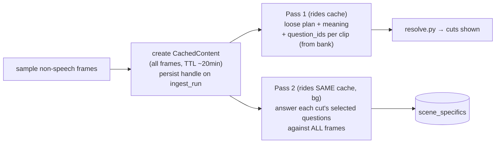

# vcut Pass 2 — Rich Cached Questions (Correction Plan)

**Status:** FINAL PLAN — ready to hand to an implementing chat.
**Corrects:** the Pass-2 shortcut shipped in `seam_cut_pipeline.plan.md`'s implementation (`backend/app/services/vcut/pass2.py`).
**Branch:** build on **`local-dev-isolation`** (see §0 — this is where all seam/vcut work currently lives, uncommitted). Do **not** branch off `main`.

---

## 0. Branch context — read this first

- The working branch is **`local-dev-isolation`**. It is exactly one commit (`f33a229 feat(dev): opt-in local-dev data isolation`) ahead of `local-dev`. That commit adds opt-in isolation: when `DB_SCHEMA`/`R2_KEY_PREFIX` are set, local dev uses a separate Postgres schema (`dev`) and R2 key prefix (`dev/`) so **local smoke tests never touch production data or the prod Procrastinate queue**.
- **All** of the new pipeline work — `backend/app/services/seam/`, `backend/app/services/vcut/`, `cutviz.py`, migration `052_vcut_artifacts.sql`, the plans — is currently **uncommitted (untracked)** on this branch. Nothing is committed or pushed.
- So yes: **everything is being done on `local-dev-isolation` right now.** This Pass-2 correction continues on the same branch (or a short feature branch off it — implementer's choice). It must **not** be merged to `main` until you deliberately flip `cuts_pipeline="vcut"`; `main`/production is unaffected because `cuts_pipeline` defaults to `"v3"`.
- Practically: implement + smoke-test here against the isolated `dev` schema/R2 prefix, exactly as the last vcut smoke test was run.

---

## 1. What's wrong today (the two bugs)

Current `pass2.py` (`vcut_enrich`) does **not** match what we designed:

1. **It throws away Pass 1's frames.** Pass 2 re-extracts **one hero frame per cut** (`_hero_frames`) instead of reusing the rich frame set. The whole point of paying for the frames in Pass 1 is to answer Pass 2 against **all** of them (temporal context, what happens across the cut) — a single thumbnail cannot do that.
2. **It asks fixed questions.** A hardcoded 3-field schema (`subject`/`climax_frame`/`on_screen_text`) is asked identically for every cut. The designed "pick the relevant questions from a generic bank, per clip" step does not exist.

Also, today **neither pass uses an explicit Gemini cache at all** — Pass 1 sends frames inline every call (`_build_blocks` image blocks), and `run_pass1(cached_content=None)`. So there is nothing to reuse yet; this plan introduces the shared cache and then makes both passes ride it.

---

## 2. Target design (one line)

**Create ONE Gemini `CachedContent` from all sampled non-speech frames → Pass 1 rides it (plan + per-clip selected question-ids) → Pass 2 rides the SAME cache to answer those questions richly → `scene_specifics`.** Two vision calls total, both on the cache; the question-selection adds **zero** extra calls. Cost-first, honoring your "Pass 1 is already expensive — don't add a third pass."



---

## 3. Part A — the shared frame cache

### 3.1 Create it (once, before Pass 1)
In `orchestrate.run_vcut_ingest`, after `sampling.sample_frames_for_files(...)`, build the frame `Block`s once and create a `CachedContent`:

- Reuse `ingest_gemini.create_pass2_cache(system, blocks, model=..., ttl_seconds=...)`. It returns the cache **resource name** (or `None` on failure → run uncached, current behavior, no crash).
- **TTL:** `1200s` (20 min) — comfortably covers Pass 1 + the gap until the background `vcut_enrich` runs. Add a `vcut_cache_ttl_s` setting (default 1200) so it's tunable.

### 3.2 The one real nuance — system prompt vs. shared cache
`create_pass2_cache(system, blocks)` **bakes the `system` instruction into the cache**, and `complete_gemini` **drops any per-call `system` when `cached_content` is set** (see `_build_config`, "a CachedContent already carries the system instruction"). That design assumes *one* system reused across many batches — but we need *two different* systems (Pass 1 planning vs. Pass 2 questions) over the *same* frames.

**Chosen approach (least-risk, no change to shared llm code):**
- Create the cache with the **frames only** plus a **neutral shared system** (e.g. *"You are a video-analysis assistant. Follow the task in each turn exactly and answer only in the required schema."*).
- Carry each pass's **actual task instructions in the per-call user content** (a `text_block` prepended to that call's blocks), **not** in `system`.
- Both passes then call `complete_gemini(system=<neutral, ignored>, blocks=[task_text_block, ...], schema, cached_content=cache_name)`.

**Alternative (if the neutral-system steering proves weak):** a tiny, guarded change to `_build_config` so that when a cache was created **without** a system, a per-call `system_instruction` is allowed. Only do this if Part-A validation shows the model ignoring the user-turn task text. Prefer the no-code-change path.

### 3.3 Persist + reuse the handle
- **Migration `053_vcut_cache.sql`** (additive): `alter table public.ingest_runs add column if not exists vcut_cache jsonb;` storing `{"name": <resource>, "model": <id>, "created_at": <iso>, "ttl_s": 1200}`.
- `store.persist_vcut_cache(run_id, handle)` / `store.load_vcut_cache(run_id)` (siblings of the existing `persist_seam_and_plan`/`load_seam_and_plan`).
- `vcut_enrich` loads the handle and passes it as `cached_content` to Pass 2.
- **Fallback:** if the cache is `None` (never created) or expired/deleted, Pass 2 falls back to the **current** behavior (re-extract hero frames) so enrichment never hard-fails. Keep `_hero_frames` as the fallback path, not the primary.
- **Teardown:** `vcut_enrich` calls `delete_pass2_cache(name)` in a `finally` once done (best-effort; it expires on TTL anyway).

---

## 4. Part B — the generic question bank

A **closed** bank of question *types* (ids). Selection picks a subset per clip; Pass 2 answers only the selected ones. Closed ⇒ bounded, cheap, parseable, generic across monuments / events / actions / people. Lives in a new `backend/app/services/vcut/questions.py` (ids + output schema + the one-line prompt text each contributes).

| id | asks | output | when relevant |
|----|------|--------|---------------|
| `subject` | the main subject of the moment | short string | almost always |
| `action` | what is happening (the motion/event) | short string | any footage with change |
| `moment_type` | this cut's role | enum `{establishing, build, peak, aftermath, transition}` | almost always |
| `setting` | where / environment | short string | scene-establishing footage |
| `on_screen_text` | visible text (signage/captions/UI), verbatim | string or `""` | any footage that may contain text |
| `notable_object` | a prominent object / product / landmark | short string or `""` | product, monument, hero-object shots |
| `count` | rough count of a repeated key element | int or `null` | repeated-action / crowd footage |
| `motion_quality` | energy of the shot | enum `{static, subtle, dynamic}` | always (cheap, deterministic-ish) |
| `continuity_cue` | does it visually continue/precede another shown moment | short hint or `""` | multi-clip sequences |

Rules: outputs are short; unknown ⇒ empty/`null`, never invented; the bank is **closed** — selection can only choose existing ids, never mint new questions. Start with these 9; tune later (it's just a table).

---

## 5. Part C — question SELECTION (folded into Pass 1, recommended)

Pass 1 **already** makes one cached vision call over all clips and already emits a per-clip `meaning`. Selecting relevant question-ids is a trivial addition to that same call — **no extra call, no extra frames**, directly honoring the cost constraint. Extend `pass1.Pass1Schema`:

```python
class _ClipOut(BaseModel):
    file_id: str
    meaning: str = ""
    loose_cuts: List[_LooseCutOut] = []
    question_ids: List[str] = []   # NEW: subset of the closed bank (§4), relevant to THIS clip
```

- Add to the Pass-1 system prompt: the bank (ids + one-liners) and *"also list `question_ids`: the subset of these that are worth answering for this clip; choose only what genuinely applies."*
- Validate/whitelist against the bank ids in `run_pass1` (drop unknowns, dedupe). If a clip selects none, apply a small default set (`subject`, `action`, `moment_type`).
- Because Pass 1 sees **all** clips in one call, selections stay consistent across a shoot (a factory set gets `notable_object`/`on_screen_text`; a landscape set doesn't).

**Alternative (separate middle text pass):** a cheap **text-only** flash-lite call taking all `meaning`s → per-clip `question_ids`. Cleaner separation, ~free (no images), but it *is* a third call. Only adopt if folding degrades Pass 1's cut-planning quality in validation. **Default = fold into Pass 1.**

Persist selection: it already lands in `loose_plan` if we add `question_ids` to `ClipLoosePlan.to_dict()` (do this), so `vcut_enrich` reads it back from the persisted plan with no new column.

---

## 6. Part D — rewrite Pass 2 to answer richly against the cache

Rewrite `pass2.run_enrich` to:

1. Load `loose_plan` (for per-clip `question_ids` + meaning) and `vcut_cache` handle from the run.
2. Load this run's `kind='video'` cut_records (`_video_cuts_for_run`) — each carries `file_id`, `src_in_ms`, `src_out_ms`, `hero_ts_ms`.
3. **One cached vision call** (batched, all cuts): per-call user content =
   - a compact **task text block** listing, for each `cut_id`: its `file_id`, time window `[in,out]ms`, hero ts, meaning, and the **selected question ids** for that cut's clip;
   - instruction: *"Using the cached frames for each file, answer the listed questions for each cut_id, looking at the frames within that cut's time window."*
   - **No images in the per-call content** — they're in the cache.
4. Structured output: `answers: [{cut_id, fields: {<question_id>: <value>}}]`, keyed by cut_id, one field per selected question (schema built dynamically from the union of selected ids, or a superset schema with unused fields left empty).
5. Write `fields` to `cut_records.scene_specifics` via the existing `update_cut_scene_specifics` (per-cut, best-effort, fail-open — unchanged contract).
6. `accumulate_pass2_usage`; `delete_pass2_cache` in `finally`.
7. **Fallback** (cache `None`/expired): fall back to the current hero-frame path but STILL using the selected `question_ids` (degraded context, correct questions).

Keep every existing safety property: background task, never touches boundaries, per-cut isolation, empty-input no-ops.

---

## 7. Data-model / config summary

- **Migration `053_vcut_cache.sql`** — `ingest_runs.vcut_cache jsonb` (additive; old pipeline ignores it).
- **`resolve.ClipLoosePlan`** — add `question_ids: List[str]` to the dataclass + `to_dict`/`from_dict` (so it round-trips through `loose_plan`).
- **`config.Settings`** — add `vcut_cache_ttl_s: int = 1200`.
- **`questions.py`** (new) — the closed bank (§4).
- No frontend change (scene_specifics already rides the `cut_records` read path).

---

## 8. Interaction with the energy slider (call it out, don't silently break it)

`POST /cuts/energy` deletes + re-inserts `kind='video'` rows, which **drops `scene_specifics`** written by Pass 2, and it does **not** re-enqueue enrichment. With Pass 2 now richer, that loss is more visible. **Fix in this plan:** after the re-insert in `set_cuts_energy`, call `defer_vcut_enrich(project_id, run_id)` so specifics re-attach against the (still-warm or re-created) cache. Cheap and keeps the two consistent. (If the cache has since expired, the fallback path handles it.)

---

## 9. Testing

- **`test_vcut_questions.py`** — bank is closed; selection validation drops unknown ids, dedupes, applies the default set on empty.
- **`test_vcut_pass1.py`** (extend) — `question_ids` parsed, whitelisted, round-trips through `loose_plan` to/from dict.
- **`test_vcut_pass2.py`** (rewrite) — with a mocked `complete_gemini`: builds one batched call, no images in per-call content when a cache handle is present; falls back to hero frames when handle is `None`; writes per-cut `scene_specifics` from the selected fields only; unknown `cut_id`s ignored.
- **Cache unit** — `create_pass2_cache` returns `None` ⇒ both passes proceed uncached (no crash).
- **Live smoke** (isolated `dev` schema/R2): re-run the drone/factory folder `8a5217b7...`; confirm (a) one cache created + reused across both passes (check `cache_read_input_tokens > 0` on Pass 2 usage), (b) `scene_specifics` now carry clip-appropriate fields (e.g. `notable_object`/`on_screen_text` on machinery, not on empty sky), (c) energy re-derive re-attaches specifics.

---

## 10. Sequencing

1. `questions.py` (the bank) + `test_vcut_questions.py`.
2. Migration `053_vcut_cache.sql`; `store.persist_vcut_cache`/`load_vcut_cache`; `ClipLoosePlan.question_ids` round-trip; `config.vcut_cache_ttl_s`.
3. Cache creation in `orchestrate.run_vcut_ingest` (Part A) + neutral-system wiring; thread `cached_content` into `run_pass1`.
4. Pass 1 `question_ids` selection (Part C) + validation.
5. Rewrite `pass2.run_enrich` (Part D) with cache-ride + fallback; teardown.
6. `set_cuts_energy` re-enqueue enrich (§8).
7. Tests green (repo-wide `test_*.py`) + pyflakes clean.
8. Live smoke on the isolated dev tables.

Nothing merges to `main`; nothing flips `cuts_pipeline`. This is all validated behind the flag on `local-dev-isolation`.

---

## 11. Open decisions

- **Fold vs. separate middle pass** (§5) — default fold into Pass 1; separate text pass only if folding hurts cut quality.
- **Cache system handling** (§3.2) — default neutral-system-in-cache + task-in-user-turn; `_build_config` tweak only if steering is weak.
- **Bank contents** (§4) — start with the 9; add/trim after seeing real `scene_specifics`.
- **TTL** — 1200s default; raise if the enrich task is ever queued behind a long backlog.

## 12. Risks

- **Cache TTL race** — mitigated by generous TTL + a real fallback path (never hard-fails). This is the exact concern the current implementation used to *justify skipping the cache*; here it's handled instead of avoided.
- **Neutral-system steering** — if flash-lite underweights user-turn instructions vs. a baked system, escalate to the `_build_config` tweak (§3.2 alternative).
- **Cost** — still two vision calls per project (Pass 1 + Pass 2), both cache-backed; question-selection is free (folded). No net new call vs. today; Pass 2 gets *cheaper per token* on the cache (cached input is discounted) while gaining full-frame context.
