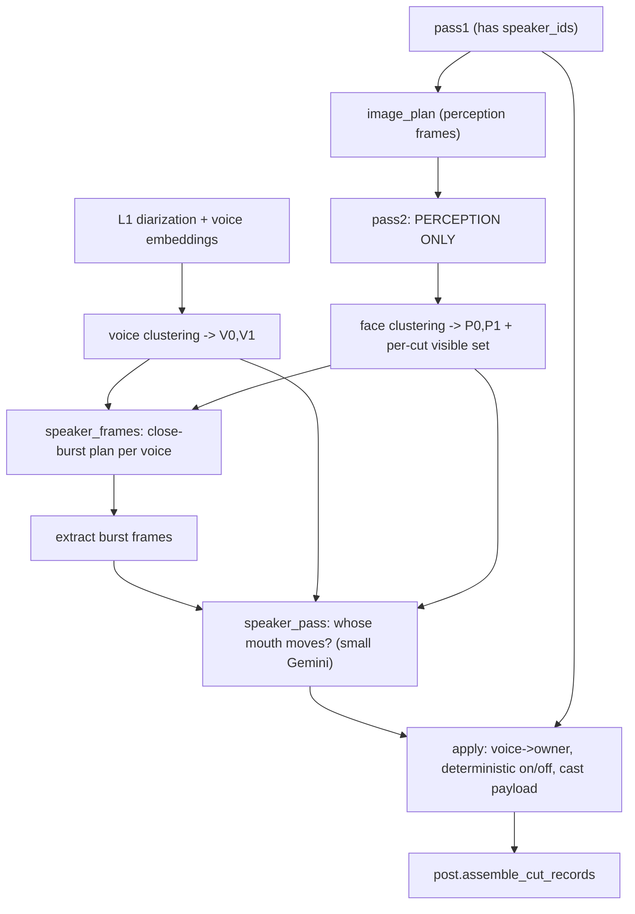

# Voice-first identity layer

Status: proposed. Implement from this doc. Supersedes the motion-correlation
half of `identity_map.plan.md` (Phase 1 `bind.py`) and removes the speaker
guesses from Pass 2.

## 1. Problem

The current identity map derives who-is-on-camera from two fragile sources:

1. **Motion correlation** (`backend/app/services/l3/identity/bind.py`): assumes
   "the talker moves more than the listener" and correlates whole-frame
   `action_energy` against each diarized voice's turns. The assumption breaks
   constantly in seated dialogue (animated listeners, still talkers) and it is
   whole-frame motion, not mouth motion.
2. **Per-still LLM guesses** in Pass 2: `CutJudgment.on_camera` /
   `CutJudgment.speaker` / `PersonLook.speaking`. Unreliable, and the origin of
   the podcast "always shows the non-speaker" behavior. When `cut.speaker` was
   null (most cuts), on/off-camera fell back to a near-random per-still guess.

We also throw away the assumption that **one camera frames one person**
(`reconcile.py` majority-votes a whole file into ONE fingerprint), which is
wrong for any multi-person framing.

## 2. Design in one line

Find distinct voices once across all clips (audio embeddings), bind each voice
to a face with ONE small Gemini pass that looks at a few very-close frames at
the instant the voice is loudest and asks *whose mouth is moving*, build a
global cast, and make on/off-camera a deterministic lookup.

Two facts that make this cheap and reliable, already in the codebase:

- **Deterministic per-beat voice already exists.** Pass 1 stamps every speech
  cut with `SpeechCut.speaker_ids` (`backend/app/services/l3/pass1.py:42`) from
  word-level diarization. "Who is talking this beat" was never the LLM's job to
  guess — it is already deterministic. The Pass 2 `speaker` field was redundant.
- **The loud instant is already computed.** `post._salience`
  (`backend/app/services/l3/post.py:348`) fuses the `rms_db` loudness envelope +
  `action_energy` + onsets into `salience.peak_ms`. `rms_db` (per file, with
  `hop_ms`) is exactly the "voice is loudest -> mouth most open" signal for
  frame picking. `motion.blur` gives sharpness; `video_segments._sharpest_ms`
  snaps to crisp instants.

Also already present: `PersonLook` (`pass2.py:138`) lists EVERY visible person
per cut (`description`, `appearance`, `position`). Multi-person perception
already exists; only the identity layer collapses it.

## 3. Separate the two questions (this is what makes on/off deterministic)

- **"Whose voice is this?"** — a GLOBAL fact, established ONCE per voice by the
  small binding pass: `V0 -> P0`.
- **"Is that person on camera right now?"** — a PER-BEAT fact that is then pure
  code: `on_camera == owner(voice) in visible_persons(cut)`. No model per beat.

Identity anchor = the **person (face)**; the voice binds TO the person. So if
voice clustering OVER-splits (same person sounds different in two clips), both
fragments bind to the same person and self-heal. The only dangerous direction
is voice MERGING two people — so cluster voices conservatively (over-split is
the safe failure, same stance `reconcile.py` already takes for faces).

## 4. The frame-picking logic (centerpiece)

New module `backend/app/services/l3/identity/speaker_frames.py`. Deterministic,
no model call. For each GLOBAL voice `V`, produce a small set of close-burst
frames that most reliably reveal whose mouth moves while `V` speaks.

1. **Collect V's turns** across all files, mapping each file's local
   diarization label to the global voice from Phase B. Skip files with no
   voiceprint mapping.
2. **Clean-window filter.** For each turn, carve the maximal sub-span where NO
   other voice overlaps within `GUARD_MS = 150`, and length `>= MIN_WIN_MS =
   400`. Overlapping speech contaminates "whose mouth moves," so exclude it.
3. **Candidate framing.** Find the Pass-2 cut(s) covering the window and the
   prominent visible person(s), using Phase D's per-cut visible set +
   `subject_box` area + `position`:
   - **Single candidate** — one person recurs whenever V speaks: strong prior
     owner (the "recurrent subject" heuristic the design leans on). Still
     confirmed by mouth motion.
   - **Multi candidate** (podcast one camera framing two people, or an outlook
     group showing P0 and P1): build a burst framing EACH candidate at the same
     instant so the pass can pick whose mouth actually moves.
4. **Reliability score per window** (rank; keep top `K = 4`; spread across
   distinct clips/persons):
   - loudness peak height (`rms_db`, clip-normalized) — louder voiced instant =
     mouth most open,
   - sharpness (`1 - normalized blur`),
   - single-speaker isolation margin (how clean the window is),
   - face prominence (`subject_box` area; `position` present),
   - diversity bonus for different clips / candidate persons.
5. **Micro-burst extraction.** Center `t*` = loudness-peak instant in the window
   (`rms_db` argmax over the window; or the covering cut's `salience.peak_ms`).
   Extract `N = 3` frames at `t*-d, t*, t*+d`, `d ~= 90 ms` (~180 ms total,
   syllable scale), each snapped to the nearest sharp instant within +/-1 hop
   (`_sharpest_ms`). Spacing rationale: articulation is ~3-7 Hz, so frames need
   ~120-300 ms apart to show mouth CHANGE; closer collapses to duplicate stills
   (widen `d`, or drop to 2 frames for a short window).
6. **Off-camera detection.** If V has no clean window with any prominent visible
   person (turns land on b-roll / no face), OR across chosen windows no mouth
   moves, flag V **off-camera / no owner** — the expected narration / podcast-
   listener case, handled explicitly, never forced to a face.

Output: `[(voice, window_id, candidate_person_hint, [(file_id, ts_ms) x N]) ...]`.
Bounded by `K x N x candidates x n_voices` — a handful of voices => tiny plan.

Chosen defaults (tunable; clip-relative where possible): `GUARD_MS=150`,
`MIN_WIN_MS=400`, `K=4`, `N=3`, `d=90ms`, conservative voice-merge cosine
threshold, face-cluster cap = 3 majors.

## 5. Components

### Phase A — L1 voice embeddings
- `backend/app/services/l1/diarization.py`: pyannote 3.1 already computes
  speaker embeddings during clustering; capture one vector per (file-local)
  speaker (mean over that speaker's segments; drop turns < ~700ms as too short).
  Extend `DiarizationResult` with `embedding_by_speaker: Dict[str, List[float]]`.
- Persist: migration adds `transcripts.speaker_embeddings jsonb` (or a
  `voice_prints(file_id, speaker, embedding)` table). Best-effort / fail-open:
  no embeddings -> skip voice clustering, fall back to per-file voices.

### Phase B — cross-clip voice clustering
- New `backend/app/services/l3/identity/voices.py`: cluster `(file_id,
  local_speaker)` voiceprints across files by cosine similarity, CONSERVATIVE
  threshold (over-split safe). Unify outlook-group members via the shared
  authoritative audio (`sync.lattice_merge.authoritative_view`) so a group's
  cameras share one voice set. Output global voices `V0..Vn` and a
  `(file_id, local_speaker) -> V` map.

### Phase C — Pass 2 slimming
- `backend/app/services/l3/pass2.py`: remove `on_camera` and `speaker` from
  `CutJudgment` (`:190-191`) and `Pass2Cut` (`:268`), and `speaking` from
  `PersonLook` (`:148`). Keep `people[] = {description, appearance, position}`
  (needed for visibility + face clustering). Trim prompt text asking for
  on_camera / speaker / speaking (~`:436`, ~`:475-490`, ~`:514-522`). Fewer
  fields also improves Flash-Lite reliability.
- Backfill deterministic `voice_ids` onto `Pass2Cut` from Pass 1
  `speaker_ids` mapped through global voices, in `pass2.backfill_locators`
  (or a post step). This replaces the removed LLM `speaker`.

### Phase D — face clustering redesign
- `backend/app/services/l3/identity/reconcile.py`: change from ONE fingerprint
  per file to per-cut person-OCCURRENCE clustering -> global persons `P0..Pn`
  (same zero-disagreement union-find in `cluster_files`, fed occurrences).
  Cap the top 3 "majors" by prominence (`subject_box` area + how often they
  appear + presence during speech windows); collapse the rest to an anonymous
  "other"; a crowd -> leave unbound. Produce `persons[]` (traits + display +
  main/other + owned voices, filled after Phase F) and a **per-cut
  visible_persons set**. Drop the one-person-per-file assumption (and the
  `_multi_person_lone_files` guard in `apply.py`, now unnecessary).

### Phase E — binding frame plan
- Implement `speaker_frames.py` per section 4.

### Phase F — voice->face binding pass (small Gemini)
- New `backend/app/services/l3/identity/speaker_pass.py` + prompt. Input per
  voice: the micro-burst images (labeled by window/candidate) + the cast
  descriptions (`P0`/`P1` traits) so the model can name which described person
  is speaking. Task: "across these close frames, is any visible person's mouth
  actively moving? If yes, which described person? If nobody clearly speaks,
  answer none." Output tiny: per-window vote. Code aggregates -> `voice ->
  owner + confidence`; require majority + margin, else leave unbound
  (owner unknown). No owner anywhere -> off-camera voice. Keep "model perceives,
  code decides": the model only says which visible face is mouthing.

### Phase G — deterministic on/off + cast (rewrite apply.py)
- Rewrite `backend/app/services/l3/identity/apply.py`: delete motion bind
  (`_bind_all`, `bind_file`/`bind_outlook_group` usage). New pipeline: voice
  clustering (B) + speaker pass (F) + face clustering (D). Per speech cut:
  `voice = voice_ids` (deterministic), `owner = voice->person`, `on_camera =
  owner in visible_persons(cut)`. Compose the persisted cast payload: persons
  (traits, main/other, owned voices), per-cut visible persons, per-cut speaker
  person + on/off.

### Phase H — footage map + brain
- `backend/app/services/l3/footage_map.py`: render a CAST table once (`P0`
  traits, main/other, owned voices), per-beat `PIC:` person ids, and `SND:`
  person id with `ON-CAM`/`OFF-CAM` (deterministic). Replace `_pic_who` /
  `_speaker_handle` / `_global_speaker` alias+motion logic with the new
  cast/visible/owner lookups. Off-camera speaker renders `OFF-CAM` with no ID.
- `backend/app/services/l3/converse.py`: update READING A BEAT LINE + guidance
  to the cast-table / ON-CAM-OFF-CAM model.

### Phase I — migrations + ingest wiring
- Migration: voice embeddings storage (Phase A); `cut_records` fields
  (`voice_id`, visible `person_ids`, `speaker_person`, `speaker_on_camera`);
  `identity_map` payload shape (persons with owned voices; drop `bound_voice`
  motion output).
- `backend/app/services/l3/ingest.py` new order: `pass1 -> image_plan ->
  pass2 (perception)`; `voice cluster` after L1 embeddings; `face cluster`
  after pass2; `speaker_frames -> extract burst frames -> speaker_pass ->
  apply (on/off + cast)` before `post.assemble_cut_records` (`:260-265`).

### Phase J — remove motion binding
- Delete `backend/app/services/l3/identity/bind.py` and its tests/references
  once `apply.py` no longer imports it.

## 6. Pipeline

## 7. Decisions (defaults chosen)

- Binding pass runs PER VOICE (a handful of calls), not per clip.
- Face appearance clustering stays the "who is visible" source; voice embeddings
  are the cross-clip identity spine (person is the anchor, voice binds to it).
- Top 3 majors; extras -> "other"; crowds -> unbound.
- Owner undeterminable -> brain told "owner unknown" (honest ignorance), never a
  guess. This is expected and correct for narration / pure b-roll / ambiguous
  frames.

## 8. Known limits (acceptable, by design)

- Mouth-motion from a few frames is still a perceptual judgment; mitigated by
  picking the loud/clean/frontal instant and requiring agreement across `K`
  windows. Disagreement -> unbound, not a wrong bind.
- Pure b-roll / music has no voice to cluster and no face to bind -> off-camera
  voice or no entry. Expected.
- Voice embeddings degrade with heavy background music, whispering, very short
  turns, overlapping speech (dropped from fingerprints).
- Look-alike faces still collide on 8 categorical traits; over-split is safe and
  the 3-major cap limits blast radius.
